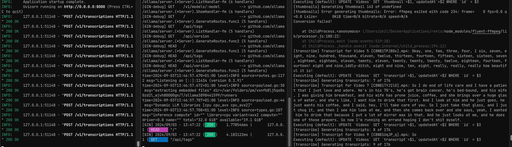
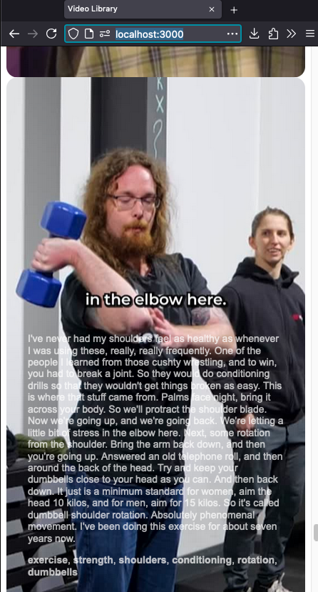

# 📽️ localreels

One day I had an idea to create a video library of useful video clips, automatically tagged for a kind of local instagram reels experience. I was using this for all the saved clips I ripped from my instagram account, health/gym tips etc.

This is very much a POC and doesn't have a complete UI, but here it is:

- FastWhisperAPI STT audio transcription (requires to be running)
- Ollama auto tag generation (requires external ollama instance)
- Thumbnail generator (via ffmpeg)
- Local sqlite db
- Web interface (TODO, basic POC exists)

## Running:
- Install/Run [FastWhisperAPI](https://github.com/3choff/FastWhisperAPI) locally
  - default port `8000` configured in `getTranscriptions.mjs`
- Install/Run [ollama](https://github.com/ollama/ollama) locally
  - default port `11434` configured in `generateTags.mjs`
  - with environment vars to allow origins: `OLLAMA_ORIGINS=* OLLAMA_HOST="0.0.0.0" ollama`
  - default model is `qwen2:7b-instruct-q8_0`, remember to pull it first `ollama pull qwen2:7b-instruct-q8_0`, change model/prompt in `generateTags.mjs`. Used for tag generation, results my vary depending on what model/quant you use
- Create folders (maybe?):
	- `/videos`
	- `/videos/database/`, `/videos/thumbs/`, `/videos/audio/`
- Install dependencies: `npm i`
- Start server: `npm run start`
	- Startup will first index all `.mp4` video files in `/videos`
	- Then generate thumbnails in `/videos/thumbs`
	- will create temporary audio files for TTS in `/videos/audio`
	- create/updates sqlite DB in `/videos/database`
	- No UI shows until all the videos have been indexed, thumbnailed, transcribed, and tagged
- 
- When finished, `http://localhost:3000/` will be available with a basic incomplete UI served from `/public`
- 

It's an incomplete POC, but a good starting point for this kind of thing.
